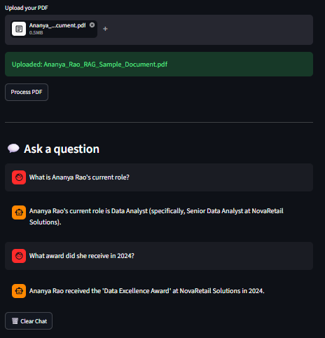

# 📄 RAG Document Q&A Chatbot

A Retrieval-Augmented Generation (RAG) chatbot that allows users to upload PDF documents and ask natural-language questions about their contents.

The application extracts text from the uploaded PDF, splits it into smaller chunks, converts the chunks into embeddings, stores them in a FAISS vector database, retrieves the most relevant information for a user's question, and uses Google Gemini to generate a grounded answer.

## 🚀 Features

- 📄 Upload PDF documents directly through the web interface
- 🔍 Semantic document search using vector embeddings
- 🧠 Retrieval-Augmented Generation (RAG)
- 🤖 Google Gemini for answer generation
- 📚 FAISS vector database for similarity search
- ✂️ Recursive text chunking for better retrieval
- 💬 Multiple questions in the same chat session
- 🧹 Clear chat functionality
- 🛡️ Answers are generated using retrieved document context
- 🌐 Interactive Streamlit web interface

## 🛠️ Tech Stack

| Technology | Purpose |
|---|---|
| Python | Application development |
| Streamlit | Web interface |
| LangChain | Document processing and RAG |
| PyPDF | PDF text extraction |
| Hugging Face | Text embeddings |
| FAISS | Vector similarity search |
| Google Gemini | Large Language Model |
| python-dotenv | Environment variable management |

## 🧠 How RAG Works

The application follows a Retrieval-Augmented Generation pipeline:

    User uploads PDF
            ↓
    PDF text extraction
            ↓
    Text chunking
            ↓
    Hugging Face embeddings
            ↓
    FAISS vector database
            ↓
    User asks a question
            ↓
    Similarity search
            ↓
    Relevant document context
            ↓
    Google Gemini
            ↓
    Final answer

## 📂 Project Structure

    rag-document-qa/
    │
    ├── app.py
    ├── qa_chain.py
    ├── ingest.py
    ├── check_models.py
    ├── test_gemini.py
    │
    ├── .env
    ├── .gitignore
    ├── requirements.txt
    │
    ├── faiss_index/
    │
    ├── chatbot.png
    └── README.md

## 📄 File Description

### app.py

Contains the Streamlit user interface, PDF upload functionality, chat interface, and application interaction logic.

### ingest.py

Handles PDF loading, document chunking, Hugging Face embeddings, and FAISS vector-store creation.

### qa_chain.py

Handles document retrieval and question answering using the retrieved document context and Google Gemini.

### check_models.py

Used during development to check available and configured models.

### test_gemini.py

Used to test the Google Gemini API connection.

### faiss_index/

Contains the FAISS vector index used for semantic document retrieval.

### chatbot.png

Screenshot of the working RAG Document Q&A Chatbot application.

## ⚙️ Installation

### 1. Clone the repository

    git clone https://github.com/YOUR_USERNAME/rag-document-qa.git

Move into the project directory:

    cd rag-document-qa

### 2. Create a virtual environment

    python -m venv .venv

Activate the virtual environment on Windows:

    .venv\Scripts\activate

### 3. Install dependencies

    pip install -r requirements.txt

## 🔑 API Configuration

This project uses Google Gemini for generating answers.

Create a `.env` file in the project root:

    GOOGLE_API_KEY=your_google_api_key_here

Replace `your_google_api_key_here` with your actual Google Gemini API key.

### Important

Never upload your `.env` file or API key to GitHub.

Add the following to `.gitignore`:

    .env
    .venv/
    __pycache__/
    *.pyc
    faiss_index/

## ▶️ Running the Application

Start the Streamlit application:

    streamlit run app.py

The application will open locally at:

    http://localhost:8501

## 📖 How to Use

### Step 1 — Upload a PDF

Select a PDF document using the upload button.

### Step 2 — Process the PDF

Click the:

**Process PDF**

button.

The application extracts the document text, creates chunks, generates embeddings, and builds the FAISS vector store.

### Step 3 — Ask Questions

Enter a natural-language question about the uploaded document.

Example:

    What is Ananya Rao's current role?

The system retrieves relevant information from the document and generates an answer.

### Step 4 — Continue the Conversation

Multiple questions can be asked in the same chat session without losing previous questions and answers.

### Step 5 — Clear the Chat

Use the **Clear Chat** button to remove the current conversation.

## 🧪 Example

For demonstration, the application can be used with a sample professional profile PDF.

Example questions:

    What is Ananya Rao's current role?

    What award did she receive in 2024?

Example response:

    Ananya Rao's current role is Data Analyst,
    specifically Senior Data Analyst at NovaRetail Solutions.

## 🔄 RAG Pipeline

### 1. Document Loading

The uploaded PDF is loaded using `PyPDFLoader`.

### 2. Text Splitting

The extracted document is divided into smaller chunks using `RecursiveCharacterTextSplitter`.

The project uses a chunk size of approximately 800 characters with an overlap of 100 characters.

### 3. Embeddings

Each document chunk is converted into a numerical vector using the Hugging Face embedding model:

`all-MiniLM-L6-v2`

### 4. Vector Storage

The embeddings are stored in a FAISS vector database.

FAISS allows the application to efficiently search for chunks that are semantically similar to the user's question.

### 5. Retrieval

When a user asks a question, the application searches the vector store and retrieves relevant document chunks.

### 6. Generation

The retrieved context is passed to Google Gemini, which generates the final answer.

## 🏗️ Architecture

    User
      │
      ▼
    Streamlit UI
      │
      ├────────────── Upload PDF
      │                    │
      │                    ▼
      │              PyPDFLoader
      │                    │
      │                    ▼
      │             Text Chunking
      │                    │
      │                    ▼
      │          Hugging Face Embeddings
      │                    │
      │                    ▼
      │                  FAISS
      │
      └────────────── Ask Question
                           │
                           ▼
                     FAISS Retrieval
                           │
                           ▼
                    Relevant Context
                           │
                           ▼
                      Google Gemini
                           │
                           ▼
                         Answer

## 🎯 Why RAG?

A standard LLM does not automatically know the contents of a user's private document.

RAG solves this by retrieving relevant information from the uploaded document and providing that information to the language model as context.

This helps the application:

- Answer questions about private documents
- Reduce dependence on the model's general knowledge
- Ground responses in retrieved document content
- Handle documents without fine-tuning the language model

## 📌 Key Concepts Demonstrated

This project demonstrates practical knowledge of:

- Retrieval-Augmented Generation
- Large Language Models
- Vector databases
- Semantic search
- Text embeddings
- Document chunking
- PDF processing
- Prompt-based generation
- LangChain
- FAISS
- Hugging Face embeddings
- Google Gemini API
- Streamlit application development
- Environment variable management

## ⚠️ Limitations

- The quality of answers depends on the quality and structure of the uploaded PDF.
- Scanned or image-only PDFs may require OCR for reliable text extraction.
- Very large documents may require additional optimization.
- The application currently focuses on PDF-based question answering.
- API usage is subject to the limits of the configured Gemini API account.

## 🔮 Future Improvements

Potential improvements include:

- Support for multiple PDFs
- Support for DOCX and TXT files
- Conversation-aware follow-up questions
- Better document metadata handling
- OCR support for scanned PDFs
- Streaming responses
- Improved retrieval strategies
- Hybrid keyword and semantic search
- Chat export functionality
- User authentication
- Cloud deployment
- Persistent vector databases

## 💻 Local Development

This project was developed and tested locally using:

- Python
- Streamlit
- LangChain
- FAISS
- Hugging Face Embeddings
- Google Gemini

## 👨‍💻 Author

**Mohit Kumar Panigrahi**

Data Analyst | AI/ML Enthusiast

- LinkedIn: [Add your LinkedIn URL]
- Portfolio: [Add your Portfolio URL]
- GitHub: [Add your GitHub URL]

## ⭐ Project Purpose

This project was built to demonstrate the practical implementation of a Retrieval-Augmented Generation system, combining document processing, vector search, embeddings, LLMs, and an interactive web application into a complete end-to-end project.